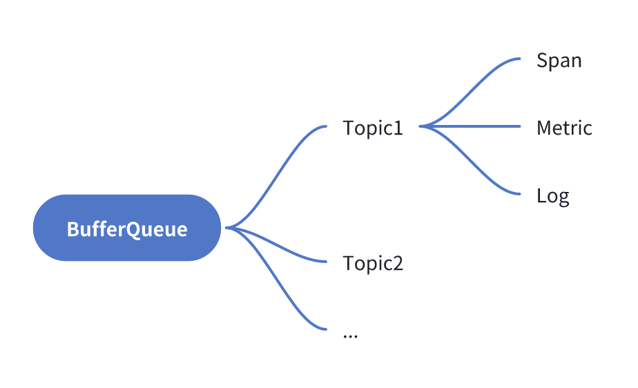
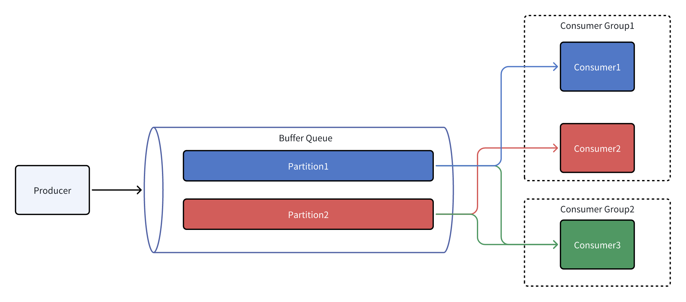

BufferQueue
===========

[](https://codecov.io/gh/eventhorizon-cli/BufferQueue)
[](https://www.nuget.org/packages/BufferQueue/)

English | [简体中文](./README.zh-CN.md)

BufferQueue is a high-performance buffer queue implementation written in .NET, which supports multi-threaded concurrent operations.

The project is an independent component separated from the [mocha](https://github.com/dotnetcore/mocha) project, which has been modified to provide more general buffer queue functionality.

BufferQueue currently provides two storage modes:

- Memory: in-process segmented memory storage, optimized for high-throughput batch consumption.
- MemoryMappedFile: local memory-mapped segment files with persisted producer and consumer offsets.

## Applicable Scenarios

Scenarios that require concurrent batch processing of data when the speed between producers and consumers is inconsistent.

Use Memory mode when the queue only needs to buffer data inside the current process and maximum consumption throughput is the priority.

Use MemoryMappedFile mode when produced data and committed consumer offsets need to survive process restarts. MemoryMappedFile mode is a local persistence mechanism for one active queue instance; it does not coordinate multiple processes writing to the same topic directory.

## Comparison with Common In-Memory Queues

**BufferQueue keeps memory-mode writes close to `Channel<T>`, while its core advantage is high-performance batch consumption.**

The project includes BenchmarkDotNet benchmarks that compare `MemoryBufferQueue<T>` in BufferQueue's Memory mode with `Channel<T>` and `BlockingCollection<T>` for concurrent producing and consuming. The table below summarizes the `Channel<T>` comparison results.

Summary:

- Producing: `MemoryBufferQueue<T>` is close to `Channel<T>` under the recorded parameters. Its elapsed time is about `17%` higher in Unbounded mode and `21%` higher in Bounded mode, and both queues complete the 8,192-item concurrent write within the same sub-millisecond range.
- Consuming: `MemoryBufferQueue<T>` is mainly optimized for batch consumption. In this benchmark set, larger batches usually show a clearer advantage, up to about `84x` under the recorded parameters.
- Memory allocation: `MemoryBufferQueue<T>` allocates less in producing scenarios; `Channel<T>` allocates less in consuming scenarios.

Representative results from the recorded benchmark runs are retained below. The in-memory queue comparisons use
`MessageSize = 8192`. The producing rows run both capacity modes in the same `Fixed` job with `LaunchCount = 1`,
`WarmupCount = 6`, and `IterationCount = 15` on .NET 10. The consuming rows are retained from the earlier recorded
run and were not rerun as part of this producing benchmark update. The MemoryMappedFile queue comparisons use
`MessageSize = 1024` and a short-run job to keep their file-backed runs brief.

Producer and consumer concurrency are derived from `Environment.ProcessorCount`, which was `12` for the recorded
results. Producing uses `12` tasks sharing one `Channel<T>` writer or one `MemoryBufferQueue<T>` producer; the
MemoryBufferQueue has `12` partitions. Consuming uses `12` Channel reader tasks or `12` BufferQueue consumers over
`12` partitions.

| Type | Scenario | Parameters | `Channel<T>` | `MemoryBufferQueue<T>` | Result |
| --- | --- | --- | ---: | ---: | --- |
| Producing | Unbounded | `MessageSize = 8192`, `ProducerTasks = 12` | `287.0 μs` | `335.0 μs` | Close; `Channel<T>` is about `1.17x` faster |
| Producing | Bounded | `MessageSize = 8192`, `ProducerTasks = 12` | `300.8 μs` | `364.1 μs` | Close; `Channel<T>` is about `1.21x` faster |
| Consuming | Unbounded | `MessageSize = 8192`, `BatchSize = 1000`, `ConsumerTasks = 12` | `3,461.03 μs` | `41.30 μs` | About `84x` faster under the recorded parameters |
| Consuming | Bounded | `MessageSize = 8192`, `BatchSize = 1000`, `ConsumerTasks = 12` | `2,214.21 μs` | `41.68 μs` | About `53x` faster under the recorded parameters |

Producing benchmark platform:

| Item | Value |
| --- | --- |
| OS | macOS `15.7.7` (`24G720`) |
| RID | `osx-arm64` |
| .NET SDK | `10.0.100` |
| .NET runtime | `10.0.0`, `arm64` |
| BenchmarkDotNet | `0.15.8` |
| Channel | `System.Threading.Channels 10.0.0` from the .NET `10.0.0` shared framework; assembly version `10.0.0.0`; no separate NuGet package |
| Benchmark target | `net10.0` |

Run the full benchmark with:

```shell
dotnet run -c Release --project tests/BufferQueue.Benchmarks/BufferQueue.Benchmarks.csproj
```

Run only the System.Text.Json, MessagePack, and unmanaged MMF serializer comparison with:

```shell
dotnet run -c Release --project tests/BufferQueue.Benchmarks/BufferQueue.Benchmarks.csproj -- --filter '*MemoryMappedFileSerializer*'
```

## Functional Design

1. Supports creating multiple topics, each of which can have multiple data types. Each pair of topics and data types corresponds to an independent buffer.

2. Supports creating multiple consumer groups, each with independent consumption progress. Supports multiple consumer groups to consume the same topic concurrently.

3. Supports creating multiple consumers for the same consumer group to consume data in a load-balanced manner.

4. Supports batch consumption of data, allowing multiple pieces of data to be obtained at once.

5. Supports two consumption modes: pull mode and push mode.

6. Supports two submission methods: auto-commit and manual commit in both pull and push modes. In auto-commit mode, the consumer automatically submits the consumption progress after receiving the data. If the consumption fails, it will not be retried. In manual commit mode, the consumer needs to manually submit the consumption progress. If the consumption fails, it can be retried as long as the progress is not submitted.

7. Supports multiple storage modes. Memory mode keeps data and offsets in process memory. MemoryMappedFile mode stores records in memory-mapped segment files and persists producer and committed consumer offsets to disk.



## High-Performance Design

### Partitioned Concurrency

Memory-mode consumers use a lock-free design. Consumer groups can read concurrently and advance their progress
independently without blocking one another.

### Multi-Partition Design

Each topic can have multiple partitions, each of which has an independent consumption progress, supporting multiple consumer groups to consume concurrently.

The producer writes data to each partition in a round-robin manner.

**The number of consumers must not exceed the number of partitions, and the partitions will be evenly distributed to each customer in the group**.

When a consumer is assigned multiple partitions, it consumes in a round-robin manner.

Different consumption groups' consumption progress is recorded on each partition, and the consumption progress of different groups does not interfere with each other.



### Dynamically Adjust Buffer Size

Supports dynamically adjusting the buffer size to adapt to scenarios where the production and consumption speeds are constantly changing.

## Usage Example

Install the core NuGet package:

```shell
dotnet add package BufferQueue
```

The project is based on Microsoft.Extensions.DependencyInjection, and services need to be registered before use.

BufferQueue supports two consumption modes: pull mode and push mode.

### Memory Mode Registration

Memory mode stores data in process memory. It supports optional bounded capacity.

```csharp
builder.Services.AddBufferQueue(bufferOptionsBuilder =>
{
    bufferOptionsBuilder
        .UseMemory(memoryBufferOptionsBuilder =>
        {
            // Each pair of Topic and data type corresponds to an independent buffer, and partitionNumber can be set
            memoryBufferOptionsBuilder
                .AddTopic<Foo>(options =>
                {
                    options.TopicName = "topic-foo1";
                    options.PartitionNumber = 6;
                })
                .AddTopic<Foo>(options =>
                {
                    options.TopicName = "topic-foo2";
                    options.PartitionNumber = 4;
                })
                .AddTopic<Bar>(options =>
                {
                    options.TopicName = "topic-bar";
                    options.PartitionNumber = 8;
                    // You can set the maximum capacity of the buffer
                    options.BoundedCapacity = 100_000;
                });
        })
        // Add push mode consumers,
        // scan the specified assembly for classes marked with
        // BufferPushCustomerAttribute and register them as push mode consumers
        .AddPushCustomers(typeof(Program).Assembly);
});

// Pull mode consumers can be implemented as HostedService.
builder.Services.AddHostedService<Foo1PullConsumerHostService>();
```

### MemoryMappedFile Mode Registration

MemoryMappedFile mode stores serialized records in memory-mapped files and persists offsets. The default serializer is an internal `System.Text.Json` implementation. Built-in MessagePack and unmanaged-struct serializers, as well as custom serializers, are available through `MemoryMappedFileBufferQueueOptions<T>.Serializer`.

`SegmentSizeInBytes` configures each memory-mapped segment in bytes and defaults to `256L * 1024 * 1024` (256 MiB).

`MaxRetainedConsumedSegments` optionally deletes fully consumed segments per partition. Its default is `null`, which disables deletion. `0` retains no reclaimable consumed segments; a positive value retains that many of the newest consumed segments. A segment is reclaimable only after every known consumer group has committed past it, so this setting is not a hard limit on total segment count or disk usage.

MemoryMappedFile support is distributed as a separate package:

```shell
dotnet add package BufferQueue.MemoryMappedFile
```

`BufferQueue.MemoryMappedFile` depends on the core `BufferQueue` package. The public namespaces and the `.UseMemoryMappedFile(...)` registration call are unchanged.

```csharp
builder.Services.AddBufferQueue(bufferOptionsBuilder =>
{
    bufferOptionsBuilder
        .UseMemoryMappedFile(memoryMappedFileBufferOptionsBuilder =>
        {
            memoryMappedFileBufferOptionsBuilder
                .AddTopic<Foo>(options =>
                {
                    options.TopicName = "topic-foo";
                    options.PartitionNumber = 4;
                    options.SegmentSizeInBytes = 64L * 1024 * 1024;
                    options.MaxRetainedConsumedSegments = 2;
                    options.DataDirectory = "/var/lib/bufferqueue";
                    options.FlushStrategy = MemoryMappedFileFlushStrategy.Batch;
                    options.FlushBatchSize = 100;
                    options.Serializer = new MessagePackMemoryMappedFileSerializer<Foo>();
                });
        });
});
```

### Using Memory and MemoryMappedFile Together

Memory and MemoryMappedFile topics can be registered in the same `AddBufferQueue` call. Register each
`(T, TopicName)` pair in only one storage mode so the selected storage does not depend on registration order.

```csharp
builder.Services.AddBufferQueue(bufferOptionsBuilder =>
{
    bufferOptionsBuilder
        .UseMemory(memoryBufferOptionsBuilder =>
        {
            memoryBufferOptionsBuilder.AddTopic<Foo>(options =>
            {
                options.TopicName = "topic-foo-memory";
                options.PartitionNumber = 4;
            });
        })
        .UseMemoryMappedFile(memoryMappedFileBufferOptionsBuilder =>
        {
            memoryMappedFileBufferOptionsBuilder.AddTopic<Foo>(options =>
            {
                options.TopicName = "topic-foo-mmf";
                options.PartitionNumber = 4;
                options.DataDirectory = "/var/lib/bufferqueue";
            });
        });
});
```

With the default `MessagePackSerializerOptions.Standard` options, custom types should declare an explicit MessagePack contract with stable numeric keys:

```shell
dotnet add package MessagePack --version 3.1.8
```

Applications should reference MessagePack directly so its analyzer and source generator run in the application project; the `BufferQueue.MemoryMappedFile` package's transitive runtime dependency on MessagePack does not supply these build assets.

```csharp
using MessagePack;

[MessagePackObject]
public sealed class Foo
{
    [Key(0)]
    public int Id { get; set; }

    [Key(1)]
    public string Name { get; set; } = string.Empty;
}
```

`MessagePackMemoryMappedFileSerializer<T>` also accepts `MessagePackSerializerOptions`, so callers can configure a resolver, compression, or `MessagePackSecurity.UntrustedData`. Any configured resolver and formatter must be safe for concurrent use. Configuring `Serializer` is optional. If it is not configured, MemoryMappedFile mode uses the internal `System.Text.Json` implementation by default. Other formats can be integrated by implementing `IMemoryMappedFileSerializer<T>`.

For fixed-layout unmanaged structs, `UnmanagedMemoryMappedFileSerializer<T>` copies the value's in-memory representation without JSON or MessagePack encoding:

```csharp
using System.Runtime.InteropServices;

[StructLayout(LayoutKind.Sequential, Pack = 1)]
public struct Quote
{
    public long Sequence;
    public double Price;
    public int Quantity;
}

options.Serializer = UnmanagedMemoryMappedFileSerializer<Quote>.Instance;
```

The `unmanaged` constraint rejects reference fields at compile time. `[StructLayout]` is not required, but explicitly fixing the layout and packing is recommended for persisted data. Native endianness, padding, field order, packing, runtime, and process architecture are part of this raw format; avoid pointer-sized or process-specific fields and do not change the layout while existing records remain. Payload length is validated exactly during reads. This serializer removes format encoding and decoding, but the current queue contract still materializes a payload `byte[]`, so it is not a zero-copy MMF reader.

The configured serializer, numeric keys, resolver, compression, and other wire-format options must remain compatible with records already stored for the topic. Do not reuse removed numeric keys. Changing the persisted format can make existing records impossible to consume after recovery.

One serializer instance is shared by the topic partitions and can be called concurrently. Custom `IMemoryMappedFileSerializer<T>` implementations must be thread-safe and must not return `null`.

`FlushStrategy` defaults to `MemoryMappedFileFlushStrategy.Immediate`, which explicitly flushes every record. `MemoryMappedFileFlushStrategy.Batch` explicitly flushes after `FlushBatchSize` records in a partition; `FlushBatchSize` defaults to `100`. A segment rollover and a consumer commit are always flush boundaries, regardless of the configured batch size. At each boundary, the partition flushes the log successfully before advancing `producer.offset`.

Batch flushing reduces the number of explicit flushes, but a partial tail batch is not guaranteed to have been explicitly flushed when there is no subsequent production, segment rollover, or consumer commit. Applications that require every successful produce call to be an explicit durability boundary should use the default `Immediate` strategy.

MemoryMappedFile data is stored by topic and partition:

```text
{DataDirectory}/{TopicName}/partition-{PartitionId:D5}/
```

For example:

```text
/var/lib/bufferqueue/topic-foo/partition-00000/00000000000000000000.log
/var/lib/bufferqueue/topic-foo/partition-00000/producer.offset
/var/lib/bufferqueue/topic-foo/partition-00000/earliest.offset
/var/lib/bufferqueue/topic-foo/partition-00000/offsets/group-foo/consumer.offset
```

Consumer group names are used directly as offset directory names when they are valid folder names. Invalid path-component characters are percent-encoded. For example, group `orders/worker 1` is stored under:

```text
offsets/orders%2Fworker 1/consumer.offset
```

`earliest.offset` is an 8-byte little-endian checkpoint containing the earliest retained segment boundary. New consumer groups start there. Consumer creation persists an initial offset for every assigned partition, so a group that has not pulled from a partition still participates in retention. Slow, uncommitted, offline, and obsolete groups prevent deletion until their checkpoints advance. Removing an obsolete group requires stopping the queue and deleting its entire `offsets/{escaped-group-name}/` directory.

During recovery, a missing `producer.offset` is scanned forward from `earliest.offset`, or from `0` when no retention checkpoint exists. A producer offset that is behind the actual log is also scanned forward. Because `producer.offset` advances only after the corresponding log data has been flushed successfully, it can safely lag complete records that reached the log after the last checkpoint. Corrupted, ahead-of-log, non-record-boundary offsets, and missing segment files inside the retained range fail fast instead of being recreated or silently resetting progress. In `Batch` mode, an unflushed partial tail batch may be absent after an abnormal termination.

When recovering an existing MemoryMappedFile topic, do not reduce `PartitionNumber`. Historical records stored in removed partitions would no longer have a partition reader and could not be consumed, so startup fails fast with an `InvalidDataException` if existing partition directories exceed the configured partition count.

### Pull Mode Consumer

Pull mode consumer example:

```csharp
public class Foo1PullConsumerHostService(
    IBufferQueue bufferQueue,
    ILogger<Foo1PullConsumerHostService> logger) : IHostedService
{
    private readonly CancellationTokenSource _cancellationTokenSource = new();

    public Task StartAsync(CancellationToken cancellationToken)
    {
        var token = CancellationTokenSource
            .CreateLinkedTokenSource(cancellationToken, _cancellationTokenSource.Token)
            .Token;

        var consumers = bufferQueue.CreatePullConsumers<Foo>(
            new BufferPullConsumerOptions
            {
                TopicName = "topic-foo1", GroupName = "group-foo1", AutoCommit = true, BatchSize = 100,
            }, consumerNumber: 4);

        foreach (var consumer in consumers)
        {
            _ = ConsumeAsync(consumer, token);
        }

        return Task.CompletedTask;
    }

    public Task StopAsync(CancellationToken cancellationToken)
    {
        _cancellationTokenSource.Cancel();
        return Task.CompletedTask;
    }

    private async Task ConsumeAsync(IBufferPullConsumer<Foo> consumer, CancellationToken cancellationToken)
    {
        await foreach (var buffer in consumer.ConsumeAsync(cancellationToken))
        {
            foreach (var foo in buffer)
            {
                // Process the foo
                logger.LogInformation("Foo1PullConsumerHostService.ConsumeAsync: {Foo}", foo);
            }
        }
    }
}
```

Push mode consumer example:

Use the BufferPushCustomer attribute to register push mode consumers.

Push consumers will be registered in the DI container, and other services can be injected through the constructor. The ServiceLifetime can be set to control the consumer's lifecycle.

The concurrency parameter in the BufferPushCustomer attribute is used to set the consumption concurrency of the push consumer, corresponding to the consumerNumber of the pull consumer.

```csharp

[BufferPushCustomer(
    topicName: "topic-foo2",
    groupName: "group-foo2",
    batchSize: 100,
    serviceLifetime: ServiceLifetime.Singleton,
    concurrency: 2)]
public class Foo2PushConsumer(ILogger<Foo2PushConsumer> logger) : IBufferAutoCommitPushConsumer<Foo>
{
    public Task ConsumeAsync(IEnumerable<Foo> buffer, CancellationToken cancellationToken)
    {
        foreach (var foo in buffer)
        {
            logger.LogInformation("Foo2PushConsumer.ConsumeAsync: {Foo}", foo);
        }

        return Task.CompletedTask;
    }
}
```

```csharp
[BufferPushCustomer(
    "topic-bar",
    "group-bar",
    100,
    ServiceLifetime.Scoped,
    2)]
public class BarPushConsumer(ILogger<BarPushConsumer> logger) : IBufferManualCommitPushConsumer<Bar>
{
    public async Task ConsumeAsync(IEnumerable<Bar> buffer, IBufferConsumerCommitter committer,
        CancellationToken cancellationToken)
    {
        foreach (var bar in buffer)
        {
            logger.LogInformation("BarPushConsumer.ConsumeAsync: {Bar}", bar);
        }

        var commitTask = committer.CommitAsync();
        if (!commitTask.IsCompletedSuccessfully)
        {
            await commitTask.AsTask();
        }
    }
}
```

Producer example:

There are two ways to obtain a Producer:

- If the topic is fixed when declaring the dependency, inject `IBufferProducer<T>` with
  `[FromKeyedServices("topic-name")]`.
- If the topic is selected at runtime, inject `IBufferQueue` and call `GetProducer<T>(topicName)`.

In Memory mode, if bounded capacity is set, when the buffer is full, the ProduceAsync method will discard the data and throw a MemoryBufferQueueFullException.
You can use the TryProduceAsync method to check if the data was successfully sent.

```csharp
using Microsoft.Extensions.DependencyInjection;

[ApiController]
[Route("/api/[controller]")]
public class TestController(
    [FromKeyedServices("topic-foo1")] IBufferProducer<Foo> foo1Producer,
    [FromKeyedServices("topic-foo2")] IBufferProducer<Foo> foo2Producer,
    IBufferQueue bufferQueue) : ControllerBase
{
    [HttpPost("foo1")]
    public async Task<IActionResult> PostFoo1([FromBody] Foo foo)
    {
        await foo1Producer.ProduceAsync(foo);
        return Ok();
    }

    [HttpPost("foo2")]
    public async Task<IActionResult> PostFoo2([FromBody] Foo foo)
    {
        await foo2Producer.ProduceAsync(foo);
        return Ok();
    }

    [HttpPost("bar")]
    public async Task<IActionResult> PostBar([FromBody] Bar bar)
    {
        var producer = bufferQueue.GetProducer<Bar>("topic-bar");
        await producer.ProduceAsync(bar);
        // TryProduceAsync will return a boolean indicating whether the data was successfully sent.
        // bool success = await producer.TryProduceAsync(bar);
        return Ok();
    }
}
```

## Samples

See [`samples/WebAPI`](samples/WebAPI/) for a runnable ASP.NET Core example of BufferQueue registration, production, and pull/push consumption.
