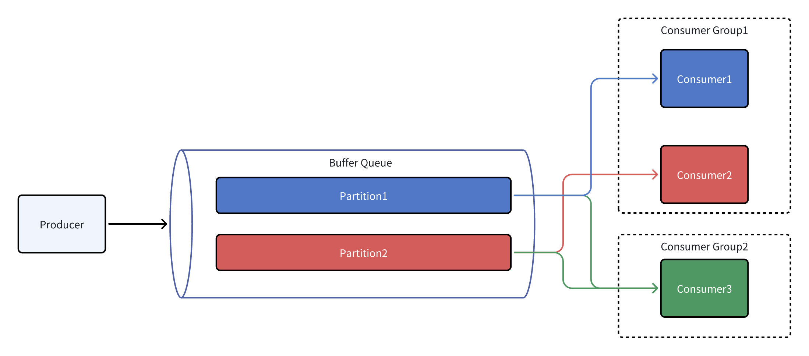

BufferQueue
===========

[](https://codecov.io/gh/eventhorizon-cli/BufferQueue)
[](https://www.nuget.org/packages/BufferQueue/)

English | [简体中文](./README.zh-CN.md)

BufferQueue is a high-performance buffer queue implementation written in .NET, which supports multi-threaded concurrent operations.

The project is an independent component separated from the [mocha](https://github.com/dotnetcore/mocha) project, which has been modified to provide more general buffer queue functionality.

Currently, the supported buffer type is only memory buffers, but more types of buffers may be considered in the future.

## Applicable Scenarios

Scenarios that require concurrent batch processing of data when the speed between producers and consumers is inconsistent.

## Functional Design

1. Supports creating multiple topics, each of which can have multiple data types. Each pair of topics and data types corresponds to an independent buffer.

2. Supports creating multiple consumer groups, each with independent consumption progress. Supports multiple consumer groups to consume the same topic concurrently.

3. Supports creating multiple consumers for the same consumer group to consume data in a load-balanced manner.

4. Supports batch consumption of data, allowing multiple pieces of data to be obtained at once.

5. Supports two consumption modes: pull mode and push mode.

6. Supports two submission methods: auto-commit and manual commit in both pull and push modes. In auto-commit mode, the consumer automatically submits the consumption progress after receiving the data. If the consumption fails, it will not be retried. In manual commit mode, the consumer needs to manually submit the consumption progress. If the consumption fails, it can be retried as long as the progress is not submitted.


## High-Performance Design

### Lock-Free Design

Both production and consumption operations are lock-free operations, which are highly efficient.

### Multi-Partition Design

Each topic can have multiple partitions, each of which has an independent consumption progress, supporting multiple consumer groups to consume concurrently.

The producer writes data to each partition in a round-robin manner.

**The number of consumers must not exceed the number of partitions, and the partitions will be evenly distributed to each customer in the group**.

When a consumer is assigned multiple partitions, it consumes in a round-robin manner.

Different consumption groups' consumption progress is recorded on each partition, and the consumption progress of different groups does not interfere with each other.



### Dynamically Adjust Buffer Size

Supports dynamically adjusting the buffer size to adapt to scenarios where the production and consumption speeds are constantly changing.

## Usage Example

Install the Nuget package:

```shell
dotnet add package BufferQueue
```

The project is based on Microsoft.Extensions.DependencyInjection, and services need to be registered before use.

BufferQueue supports two consumption modes: pull mode and push mode.

Pull mode consumer example:

```csharp

builder.Services.AddBufferQueue(options =>
{
    options.UseMemory(bufferOptions =>
        {
            // Each pair of Topic and data type corresponds to an independent buffer, and partitionNumber can be set
            bufferOptions.AddTopic<Foo>("topic-foo1", partitionNumber: 6);
            bufferOptions.AddTopic<Foo>("topic-foo2", partitionNumber: 4);
            bufferOptions.AddTopic<Bar>("topic-bar", partitionNumber: 8);
        })
        // Add push mode consumers,
        // scan the specified assembly for classes marked with
        // BufferPushCustomerAttribute and register them as push mode consumers
        .AddPushCustomers(typeof(Program).Assembly);
});
```

Pull mode consumer example:

```csharp
public class Foo1PullConsumerHostService(
    IBufferQueue bufferQueue,
    ILogger<Foo1PullConsumerHostService> logger) : IHostedService
{
    private readonly CancellationTokenSource _cancellationTokenSource = new();

    public Task StartAsync(CancellationToken cancellationToken)
    {
        var token = CancellationTokenSource
            .CreateLinkedTokenSource(cancellationToken, _cancellationTokenSource.Token)
            .Token;

        var consumers = bufferQueue.CreatePullConsumers<Foo>(
            new BufferPullConsumerOptions
            {
                TopicName = "topic-foo1", GroupName = "group-foo1", AutoCommit = true, BatchSize = 100,
            }, consumerNumber: 4);

        foreach (var consumer in consumers)
        {
            _ = ConsumeAsync(consumer, token);
        }

        return Task.CompletedTask;
    }

    public Task StopAsync(CancellationToken cancellationToken)
    {
        _cancellationTokenSource.Cancel();
        return Task.CompletedTask;
    }

    private async Task ConsumeAsync(IBufferPullConsumer<Foo> consumer, CancellationToken cancellationToken)
    {
        await foreach (var buffer in consumer.ConsumeAsync(cancellationToken))
        {
            foreach (var foo in buffer)
            {
                // Process the foo
                logger.LogInformation("Foo1PullConsumerHostService.ConsumeAsync: {Foo}", foo);
            }
        }
    }
}
```

Push mode consumer example:

Use the BufferPushCustomer attribute to register push mode consumers.

Push consumers will be registered in the DI container, and other services can be injected through the constructor. The ServiceLifetime can be set to control the consumer's lifecycle.

The concurrency parameter in the BufferPushCustomer attribute is used to set the consumption concurrency of the push consumer, corresponding to the consumerNumber of the pull consumer.

```csharp

[BufferPushCustomer(
    topicName: "topic-foo2",
    groupName: "group-foo2",
    batchSize: 100,
    serviceLifetime: ServiceLifetime.Singleton,
    concurrency: 2)]
public class Foo2PushConsumer(ILogger<Foo2PushConsumer> logger) : IBufferAutoCommitPushConsumer<Foo>
{
    public Task ConsumeAsync(IEnumerable<Foo> buffer, CancellationToken cancellationToken)
    {
        foreach (var foo in buffer)
        {
            logger.LogInformation("Foo2PushConsumer.ConsumeAsync: {Foo}", foo);
        }

        return Task.CompletedTask;
    }
}
```

```csharp
[BufferPushCustomer(
    "topic-bar",
    "group-bar",
    100,
    ServiceLifetime.Scoped,
    2)]
public class BarPushConsumer(ILogger<BarPushConsumer> logger) : IBufferManualCommitPushConsumer<Bar>
{
    public async Task ConsumeAsync(IEnumerable<Bar> buffer, IBufferConsumerCommitter committer,
        CancellationToken cancellationToken)
    {
        foreach (var bar in buffer)
        {
            logger.LogInformation("BarPushConsumer.ConsumeAsync: {Bar}", bar);
        }

        var commitTask = committer.CommitAsync();
        if (!commitTask.IsCompletedSuccessfully)
        {
            await commitTask.AsTask();
        }
    }
}
```

Producer example:

Get the specified producer through the IBufferQueue service and send the data by calling the ProduceAsync method.

```csharp
[ApiController]
[Route("/api/[controller]")]
public class TestController(IBufferQueue bufferQueue) : ControllerBase
{
    [HttpPost("foo1")]
    public async Task<IActionResult> PostFoo1([FromBody] Foo foo)
    {
        var producer = bufferQueue.GetProducer<Foo>("topic-foo1");
        await producer.ProduceAsync(foo);
        return Ok();
    }

    [HttpPost("foo2")]
    public async Task<IActionResult> PostFoo2([FromBody] Foo foo)
    {
        var producer = bufferQueue.GetProducer<Foo>("topic-foo2");
        await producer.ProduceAsync(foo);
        return Ok();
    }

    [HttpPost("bar")]
    public async Task<IActionResult> PostBar([FromBody] Bar bar)
    {
        var producer = bufferQueue.GetProducer<Bar>("topic-bar");
        await producer.ProduceAsync(bar);
        return Ok();
    }
}
```
