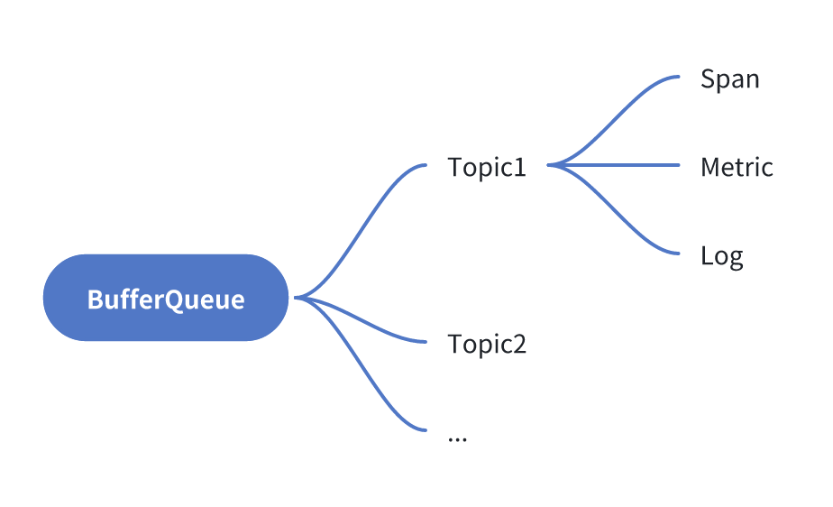
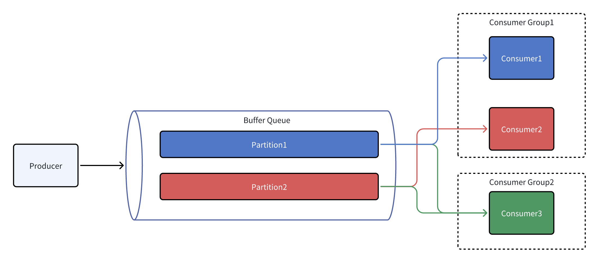

BufferQueue
===========

[](https://codecov.io/gh/eventhorizon-cli/BufferQueue)
[](https://www.nuget.org/packages/BufferQueue/)

English | [简体中文](./README.zh-CN.md)

BufferQueue 是一个用 .NET 编写的高性能的缓冲队列实现，支持多线程并发操作。

项目是从 [mocha](https://github.com/dotnetcore/mocha) 项目中独立出来的一个组件，经过修改以提供更通用的缓冲队列功能。

目前支持的缓冲区类型为内存缓冲区，后续会考虑支持更多类型的缓冲区。

## 适用场景
生产者和消费者之间的速度不一致，需要并发批量处理数据的场景。

## 功能设计：
1. 支持创建多个 Topic，每个 Topic 可以有多种数据类型。每一对 Topic 和数据类型对应一个独立的缓冲区。

2. 支持创建多个 Consumer Group，每个 Consumer Group 的消费进度都是独立的。支持多个 Consumer Group 并发消费同一个 Topic。

3. 支持同一个 Consumer Group 创建多个 Consumer，以负载均衡的方式消费数据。

4. 支持数据的批量消费，可以一次性获取多条数据。

5. 支持 pull 模式和 push 模式两种消费模式。

6. pull 模式下和 push 模式下都支持 auto commit 和 manual commit 两种提交方式。auto commit 模式下，消费者在收到数据后自动提交消费进度，如果消费失败不会重试。manual commit 模式下，消费者需要手动提交消费进度，如果消费失败只要不提交进度就可以重试。



## 高性能设计
### 无锁设计

生产和消费操作均为无锁操作，性能高效。

### 多 partition 设计
每个 Topic 可以有多个 partition，每个 partition 都有独立的消费进度，支持多个 Consumer Group 并发消费。

Producer 以轮询的方式往每个 Partition 中写入数据。

**Consumer 最多不允许超过 Partition 的数量，Partition 会均分到组内每个 Customer 上**。

当一个 Consumer 被分配了多个 Partition 时，以轮训的方式进行消费。

每个 Partition 上会记录不同消费组的消费进度，不同组之间的消费进度互不干扰。



### 动态调整缓冲区大小
支持动态调整缓冲区大小，以适应生产和消费速度不断变化的场景。

## 使用示例

安装 Nuget 包：

```shell
dotnet add package BufferQueue
```

项目基于 Microsoft.Extensions.DependencyInjection，使用时需要先注册服务。

BufferQueue 支持两种消费模式：pull 模式和 push 模式。

```csharp

builder.Services.AddBufferQueue(options =>
{
    options.UseMemory(bufferOptions =>
        {
            // 每一对 Topic 和数据类型对应一个独立的缓冲区，可以设置 partitionNumber
            bufferOptions.AddTopic<Foo>("topic-foo1", partitionNumber: 6);
            bufferOptions.AddTopic<Foo>("topic-foo2", partitionNumber: 4);
            bufferOptions.AddTopic<Bar>("topic-bar", partitionNumber: 8);
        })
        // 添加 push 模式的消费者
        // 扫描指定程序集中的标记了 BufferPushCustomerAttribute 的类，
        // 注册为 push 模式的消费者
        .AddPushCustomers(typeof(Program).Assembly);
});

// 在 HostedService 中使用 pull模式 消费数据
builder.Services.AddHostedService<Foo1PullConsumerHostService>();
```

pull 模式的消费者示例：

```csharp
public class Foo1PullConsumerHostService(
    IBufferQueue bufferQueue,
    ILogger<Foo1PullConsumerHostService> logger) : IHostedService
{
    private readonly CancellationTokenSource _cancellationTokenSource = new();

    public Task StartAsync(CancellationToken cancellationToken)
    {
        var token = CancellationTokenSource
            .CreateLinkedTokenSource(cancellationToken, _cancellationTokenSource.Token)
            .Token;

        var consumers = bufferQueue.CreatePullConsumers<Foo>(
            new BufferPullConsumerOptions
            {
                TopicName = "topic-foo1", GroupName = "group-foo1", AutoCommit = true, BatchSize = 100,
            }, consumerNumber: 4);

        foreach (var consumer in consumers)
        {
            _ = ConsumeAsync(consumer, token);
        }

        return Task.CompletedTask;
    }

    public Task StopAsync(CancellationToken cancellationToken)
    {
        _cancellationTokenSource.Cancel();
        return Task.CompletedTask;
    }

    private async Task ConsumeAsync(IBufferPullConsumer<Foo> consumer, CancellationToken cancellationToken)
    {
        await foreach (var buffer in consumer.ConsumeAsync(cancellationToken))
        {
            foreach (var foo in buffer)
            {
                // Process the foo
                logger.LogInformation("Foo1PullConsumerHostService.ConsumeAsync: {Foo}", foo);
            }
        }
    }
}
```

push 模式的消费者示例：

通过 BufferPushCustomer 特性注册 push 模式的消费者。

push consumer 会被注册到 DI 容器中，可以通过构造函数注入其他服务，可以通过设置 ServiceLifetime 来控制 consumer 的生命周期。

BufferPushCustomerAttribute 中的 concurrency 参数用于设置 push consumer 的消费并发数，对应 pull consumer 的 consumerNumber。


```csharp

[BufferPushCustomer(
    topicName: "topic-foo2",
    groupName: "group-foo2",
    batchSize: 100,
    serviceLifetime: ServiceLifetime.Singleton,
    concurrency: 2)]
public class Foo2PushConsumer(ILogger<Foo2PushConsumer> logger) : IBufferAutoCommitPushConsumer<Foo>
{
    public Task ConsumeAsync(IEnumerable<Foo> buffer, CancellationToken cancellationToken)
    {
        foreach (var foo in buffer)
        {
            logger.LogInformation("Foo2PushConsumer.ConsumeAsync: {Foo}", foo);
        }

        return Task.CompletedTask;
    }
}
```

```csharp
[BufferPushCustomer(
    "topic-bar",
    "group-bar",
    100,
    ServiceLifetime.Scoped,
    2)]
public class BarPushConsumer(ILogger<BarPushConsumer> logger) : IBufferManualCommitPushConsumer<Bar>
{
    public async Task ConsumeAsync(IEnumerable<Bar> buffer, IBufferConsumerCommitter committer,
        CancellationToken cancellationToken)
    {
        foreach (var bar in buffer)
        {
            logger.LogInformation("BarPushConsumer.ConsumeAsync: {Bar}", bar);
        }

        var commitTask = committer.CommitAsync();
        if (!commitTask.IsCompletedSuccessfully)
        {
            await commitTask.AsTask();
        }
    }
}
